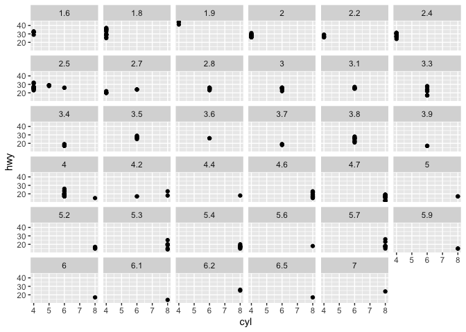
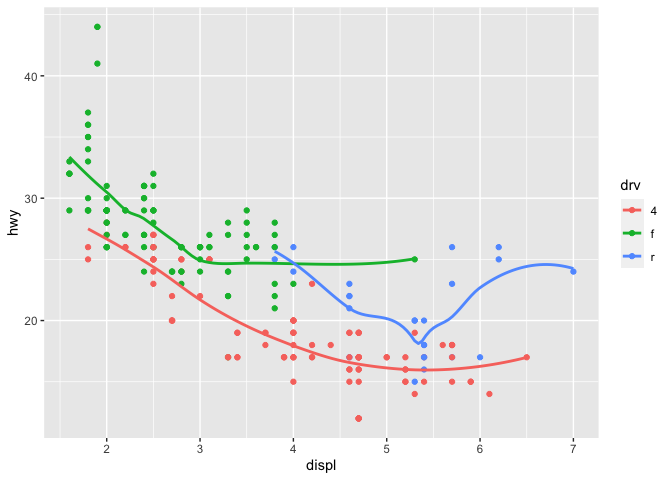

ggplotunderstanding
================
Rumo Schilling
9 Jan 2022

## Load packages and data

``` r
library(tidyverse)
library(openintro)
library(dplyr)
```

## Exercises

### Exercise 1

    ## [1] "There are 52519 pets in the dataset"

### Exercise 2

    ## [1] "There are 7 variables per pet in the dataset"

### Exercise 3

    ## # A tibble: 13,930 × 2
    ##    animal_name     n
    ##    <chr>       <int>
    ##  1 <NA>          483
    ##  2 Lucy          439
    ##  3 Charlie       387
    ##  4 Luna          355
    ##  5 Bella         331
    ##  6 Max           270
    ##  7 Daisy         261
    ##  8 Molly         240
    ##  9 Jack          232
    ## 10 Lily          232
    ## # … with 13,920 more rows

    ## # A tibble: 3 × 2
    ##   animal_name     n
    ##   <chr>       <int>
    ## 1 Lucy          439
    ## 2 Charlie       387
    ## 3 Luna          355

Lucy Charlie Luna

### Exercise 4

``` r
seattlepets %>% group_by(species) %>% count(animal_name,sort= TRUE) %>%
slice_max(n,n=5) %>% arrange(species,n)
```

    ## # A tibble: 53 × 3
    ## # Groups:   species [4]
    ##    species animal_name     n
    ##    <chr>   <chr>       <int>
    ##  1 Cat     Max            83
    ##  2 Cat     Lily           86
    ##  3 Cat     Lucy          102
    ##  4 Cat     Luna          111
    ##  5 Cat     <NA>          406
    ##  6 Dog     Daisy         221
    ##  7 Dog     Luna          244
    ##  8 Dog     Bella         249
    ##  9 Dog     Charlie       306
    ## 10 Dog     Lucy          337
    ## # … with 43 more rows

This is kind of weird, becaues it sorts them in descending order

``` r
seattlepets %>% group_by(species) %>% count(animal_name,sort= TRUE) %>%
slice_max(n,n=5) 
```

    ## # A tibble: 53 × 3
    ## # Groups:   species [4]
    ##    species animal_name     n
    ##    <chr>   <chr>       <int>
    ##  1 Cat     <NA>          406
    ##  2 Cat     Luna          111
    ##  3 Cat     Lucy          102
    ##  4 Cat     Lily           86
    ##  5 Cat     Max            83
    ##  6 Dog     Lucy          337
    ##  7 Dog     Charlie       306
    ##  8 Dog     Bella         249
    ##  9 Dog     Luna          244
    ## 10 Dog     Daisy         221
    ## # … with 43 more rows

It seems like removing the arrange argument circumvents that problem If
you first sort by n, it only shows gat names It seems also to go
alphabetically on the group_by(I tested it with primary breed sort) \###
Exercise 5

Everything above the line means that dogs names are more common

### Exercise 6

They are positvly associated. It meanst thatt if a name si more common
for a dog, it is also more common for a cat.

### Car excersise

<!-- -->
\#### HW 4 Tuesday

Answer 1. It does not close brackets. Everything in the aes puts the
data to some dimension, in this case, the variable blue. If it is
outside the aes, like in my code above, it works.

Answer 2: model,class,manufacturer,drv,fl,trans and class are categorial

cty,displ and hwy are continuous.
<!-- --><!-- -->

    ## Warning: The shape palette can deal with a maximum of 6 discrete values because
    ## more than 6 becomes difficult to discriminate; you have 38. Consider
    ## specifying shapes manually if you must have them.

    ## Warning: Removed 199 rows containing missing values (`geom_point()`).

<!-- --><!-- -->

    ## Warning: Using size for a discrete variable is not advised.

<!-- -->
mapping shape to continous throws an error when mapping continuous to…
…the color it is gradually lightening the higher the continuous variable
the size it gets bigger the higher the value of the data point On
categorical variables, those aesthetics are only used to distinguish

    ## Warning: The shape palette can deal with a maximum of 6 discrete values because
    ## more than 6 becomes difficult to discriminate; you have 38. Consider
    ## specifying shapes manually if you must have them.

    ## Warning: Removed 199 rows containing missing values (`geom_point()`).

<!-- -->
The double mapping looks pretty cool(although here are only 6 shapes)
<!-- -->
I dont understand stroke.
<!-- -->
It makes an if statement, and not a plot 3.5

``` r
 ggplot(data = mpg) + 
  geom_point(mapping = aes(x = displ, y = hwy)) + 
  facet_wrap(~ class, nrow = 2)
```

<!-- -->

``` r
ggplot(data = mpg) + 
  geom_point(mapping = aes(x = displ, y = hwy)) + 
  facet_grid(drv ~ cyl)
```

<!-- -->

## What happens when you faced a continous variable?

``` r
ggplot(data = mpg) + geom_point(mapping = aes(x = cyl,y = hwy)) +facet_wrap(~ displ)
```

<!-- -->
It makes a lot of plots(altho this is technically discrete)

## What do the empty cells in plot with facet_grid(drv \~ cyl) mean? How do they relate to this plot?

They mean that there is no car with drv = r and 5 cylinders \## 3.

``` r
ggplot(data = mpg) + 
  geom_point(mapping = aes(x = displ, y = hwy)) +
  facet_grid(drv ~ .)
```

<!-- -->

``` r
ggplot(data = mpg) + 
  geom_point(mapping = aes(x = displ, y = hwy)) +
  facet_grid(. ~ cyl)
```

<!-- -->
The code makes different plots for differents cyl /drv. It is like facet
wrap, but longer

## 4. What are the advantages of facet wrapping over coloring?

You can easily zoom on one graph, while you can see the differences
better in color coded ones. In larger datasets, I would try both once,
and see if one of them has better information. \## 5. What does facet
wrap nrow and ncol do They determine the number of rows or columns of
the plots. facet_grid does not have that, because rows and columns are
equal to the variable they represent.

## When using facet_grid() you should usually put the variable with more unique levels in the columns. Why?

Because you can scroll, and thus it is better to look at

``` r
ggplot(data = mpg,mapping = aes(x = hwy,y = cyl))+geom_smooth(color = "blue")+geom_point(mapping = aes(color = class))
```

    ## `geom_smooth()` using method = 'loess' and formula = 'y ~ x'

<!-- -->
geom_histogram is a histogram, geom_line, a line chart geom_boxplot is a
boxplot I think that the code will give a normal plot like in the
examples shown above, but the will be colorcoded after drv,and will have
the same curve as the examples in 3.6

``` r
ggplot(data = mpg, mapping = aes(x = displ, y = hwy, color = drv)) + 
  geom_point() + 
  geom_smooth(se = FALSE)
```

    ## `geom_smooth()` using method = 'loess' and formula = 'y ~ x'

<!-- -->
Oh I forgot that it is a global variable, which means it makes sense
that the lines are 3 different ones.

``` r
ggplot(data = mpg) +
  geom_smooth(
    mapping = aes(x = displ, y = hwy, color = drv),
    show.legend = FALSE
  )
```

    ## `geom_smooth()` using method = 'loess' and formula = 'y ~ x'

<!-- -->
3. Show legend disables the legend, and they used in the code because it
would be too small with that many plots.

4.  The se argument enables/disables the CI around the line, and with
    level we can adjust the level of confidence (95 % by default)

5.  The plots seem to be the same

``` r
ggplot(data = mpg, mapping = aes(x = displ, y = hwy)) + 
  geom_point() + 
  geom_smooth()
```

    ## `geom_smooth()` using method = 'loess' and formula = 'y ~ x'

<!-- -->

``` r
ggplot() + 
  geom_point(data = mpg, mapping = aes(x = displ, y = hwy)) + 
  geom_smooth(data = mpg, mapping = aes(x = displ, y = hwy))
```

    ## `geom_smooth()` using method = 'loess' and formula = 'y ~ x'

<!-- -->
Hooray I was right

6.  

``` r
ggplot(data = mpg, mapping = aes(x=displ,y = hwy))+
geom_point(stroke = 2) +
geom_smooth(se = FALSE)
```

    ## `geom_smooth()` using method = 'loess' and formula = 'y ~ x'

<!-- -->

``` r
ggplot(data = mpg,mapping = aes(x = displ,y = hwy))+
geom_point(stroke = 3) +
geom_smooth(mapping = aes(group=drv),se = FALSE)
```

    ## `geom_smooth()` using method = 'loess' and formula = 'y ~ x'

<!-- -->

``` r
ggplot(data = mpg,mapping = aes(x = displ,y = hwy,color = drv))+
geom_point(stroke = 3) +
geom_smooth(mapping = aes(group=drv),se = FALSE)
```

    ## `geom_smooth()` using method = 'loess' and formula = 'y ~ x'

<!-- -->

``` r
ggplot(data = mpg,mapping = aes(x = displ,y = hwy))+
geom_point(mapping = aes(color = drv), stroke = 3) +
geom_smooth(se = FALSE,stroke = 2)
```

    ## Warning in geom_smooth(se = FALSE, stroke = 2): Ignoring unknown parameters:
    ## `stroke`

    ## `geom_smooth()` using method = 'loess' and formula = 'y ~ x'

<!-- -->

``` r
ggplot(data = mpg,mapping = aes(x = displ,y = hwy))+
geom_point(mapping = aes(color = drv),pch = 20) +
geom_smooth(mapping = aes(linetype=drv),se = FALSE)
```

    ## `geom_smooth()` using method = 'loess' and formula = 'y ~ x'

<!-- -->
